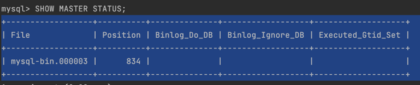

# Read-Replica PoC
This Proof of Concept (PoC) demonstrates how to set up a replica database and utilize it within our codebase. In the codebase, all read operations will be routed to the replica database, while write operations will be directed to the primary database.

## Setup
We will be setting the environment in two steps,<br />
    1. database setup <br />
    2. Code setup

## Steps to Setup database

#### Clone the repository

```shell
git clone https://github.com/SanthoshKumar-Ravi/primary-replica-PoC.git
   ```

#### Run the docker-compose file

```shell
docker-compose -f docker/docker-compose.yaml up -d
   ```
After this step, we will be having both `primary` and `readonly` instance of mysql up & running 
Let's start the replica server configuration

### Changes needs to do in primary instance

#### 1. open the bash

```shell
docker exec -it mysql-primary bash
```

#### 2. login to mysql server

```shell
mysql -uroot -p
```
enter the root password.

#### 3. change the user & privileges

```shell
ALTER USER 'syncuser'@'%' IDENTIFIED WITH 'mysql_native_password' BY 'password';
```

#### 3. grant privileges for replication slave

```shell
GRANT REPLICATION SLAVE ON *.* TO 'syncuser'@'%';
```

#### 4. Flush privileges:

```shell
 FLUSH PRIVILEGES;
```

#### 5. check master status:

```shell
 SHOW MASTER STATUS;
```
The output of the query shows details about the file and positions. (e.g)<br />


<br />
copy the value in File and position column.

By the above steps the mysql primary configurations are done.

### Changes needs to do in replica instance

#### 1. open the bash

```shell
docker exec -it mysql-replica bash
```

#### 2. login to mysql server

```shell
mysql -uroot -p
```
enter the root password.

#### 3. change the master configurations

```shell
 CHANGE MASTER TO 
  MASTER_HOST='mysql-primary', ## primary mysql hostname
  MASTER_USER='syncuser',  ## user we created for sync operation mentioned in docker-compose
  MASTER_PASSWORD='password',  ## password for the above user
  MASTER_LOG_FILE='mysql-bin.000003',  ## File value you got from the primary setup. step : 5
  MASTER_LOG_POS=834; ## Position value you got from the primary setup. step : 5
```

#### 4. start the replication process

```shell
START SLAVE;
```

#### 5. Verify the status of replication

```shell
 SHOW SLAVE STATUS
```
Confirm that column `Slave_IO_Running` and `Slave_SQL_Running` show as "Yes".

By the above steps the mysql replica configurations are done.


## Steps to Setup codebase

#### Clone the repository

``` git clone https://github.com/SanthoshKumar-Ravi/primary-replica-PoC.git ```

#### Go the folder

``` read-replica-poc ```


#### build the application
``` maven clean install ```

#### run the application
``` java -jar read-replica-poc-0.0.1.jar ```


### Commands to create user in mysql

#### Primary Instance
```
CREATE USER 'primarydbuser'@'%' IDENTIFIED BY 'password';
GRANT CREATE, ALTER, DROP, INSERT, UPDATE, DELETE, SELECT, REFERENCES, RELOAD on *.* TO 'primarydbuser'@'%' WITH GRANT OPTION;
```

#### Replica Instance
```
CREATE USER 'readdbuser'@'%' IDENTIFIED BY 'password';
GRANT CREATE, ALTER, DROP, INSERT, UPDATE, DELETE, SELECT, REFERENCES, RELOAD on *.* TO 'readdbuser'@'%' WITH GRANT OPTION;
```
